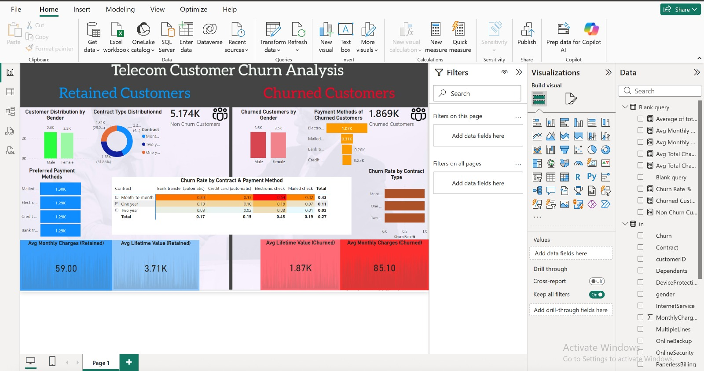

# 📊 Telecom Customer Churn Analysis (Power BI)

An end-to-end customer churn analysis dashboard built using Power BI to identify key drivers of customer retention and churn.

---

## 🚀 Project Overview

This project analyzes telecom customer data to understand:

* Why customers churn
* Which segments are at high risk
* How contract type, payment method, and services impact retention

---
## 📂 Dataset
- Source: Telecom Customer Dataset  
- Format: CSV  
- Records: ~7,000 customers  

[📥 Download Dataset](WA_Fn-UseC_-Telco-Customer-Churn.csv)
## 📸 Dashboard Preview

---

## 🔍 Key Insights

* Customers on **month-to-month contracts** show the highest churn rate
* **Electronic check users** have significantly higher churn compared to other payment methods
* Customers with **longer tenure** are less likely to churn
* **Fiber optic users** show higher churn compared to DSL users

---

## 📈 Features

* Customer segmentation (Retained vs Churned)
* Churn rate analysis by contract type
* Payment method behavior analysis
* Tenure distribution trends
* Revenue impact (Avg Monthly & Total Charges)

---

## 🛠️ Tools & Technologies

* Power BI
* DAX (Data Analysis Expressions)
* Data Modeling
* Data Visualization

---

## 📂 Repository Structure

* `customer-churn-dashboard.pbix` → Power BI project file
* `dashboard_preview.png` → Dashboard screenshot
* `dataset.csv` *(optional)* → Source data

---
## 🌐 Live Dashboard
[View Interactive Power BI Dashboard](https://app.powerbi.com/links/PNDIJZ0mUJ?ctid=27282fdd-4c0b-4dfb-ba91-228cd83fdf71&pbi_source=linkShare)

## 💡 What This Project Demonstrates

* Business problem solving using data
* Dashboard design & storytelling
* Strong DAX fundamentals
* Ability to extract actionable insights

---

## 📬 Contact

If you’d like to connect or discuss this project, feel free to reach out.
